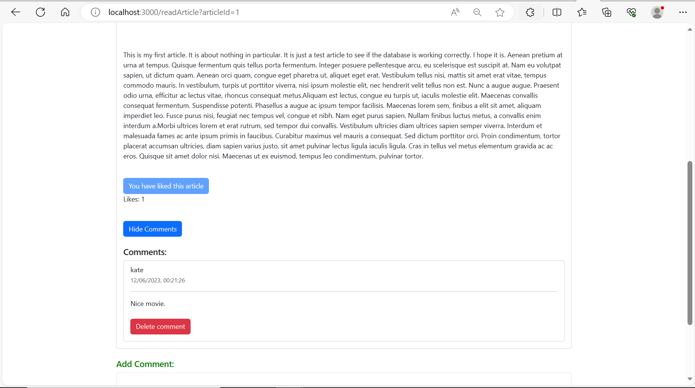

# YourBlog - A Modern Blogging Platform

Welcome to the official repository of YourBlog! Our mission is to provide a user-friendly, open-source blogging platform for writers, developers, and content creators around the world.

## 🌟 Features

- **Intuitive Editor:** Craft your posts with a clean and distraction-free editor.
- **Responsive Design:** Ensures your blog looks great on all devices.
- **Custom Themes:** Personalize your blog's appearance with customizable themes.
-  **Engagement Tools:** Readers can like and comment on articles, fostering community interaction and feedback.
- **Comment Management:** Authors have the ability to delete any comment on their articles, and users can delete their own comments.

## 🛠️ Technologies Used

- **HTML:** The standard markup language for documents designed to be displayed in a web browser.
- **CSS:** A stylesheet language used for describing the look and formatting of a document written in HTML.
- **JavaScript (JS):** A programming language that enables interactive web pages and is an essential part of web applications.
- **JSON (JavaScript Object Notation):** A lightweight data-interchange format that is easy for humans to read and write and easy for machines to parse and generate.
- **AJAX (Asynchronous JavaScript and XML):** A technique used for creating fast and dynamic web pages by making asynchronous requests to a server, allowing data to be retrieved without having to reload the page.
- **Node.js:** A JavaScript runtime built on Chrome's V8 JavaScript engine, used for building fast and scalable network applications.
- **Handlebars:** A popular templating engine that allows you to build semantic templates effectively.
- **MariaDB:** An open-source relational database management system, which is a fork of MySQL and uses SQL (Structured Query Language) for data access.


## 📷 Screenshots

|       |  |
|:------------------------:|:-----------------------:|
|       *Home Page*        |      *Log-in Page*      |
|   |  |
|      *Post Article*      |    *Create Account*     |
|   |  |
|  *Like & View Comment*   |    *Comment Article*    |


## 🚀 Getting Started

### Prerequisites

- Node.js (v14+)
- MySQL (v4.4+)

### Installation

1. Clone the repository:
   ```bash
   git clone https://github.com/yourusername/yourblogname.git
    ```
2. Navigate to the project directory and install dependencies:
   ```bash
   cd blogging-system
   npm install
    ```
   
3. Set up your environment variables in a `.env` file.

4. Start the application:
   ```bash
   node app.js
    ```

Visit `http://localhost:3000` to see the application running.


## 📜 License

This project is licensed under the MIT License. 

## 📞 Support

If you encounter any issues, have suggestions, or general inquiries, please reach out to our faraz_139@hotmail.com.


